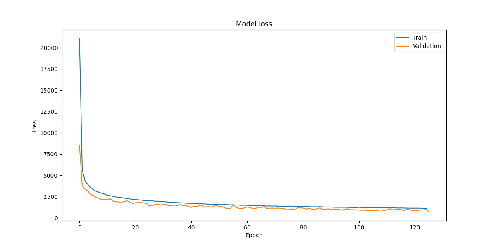
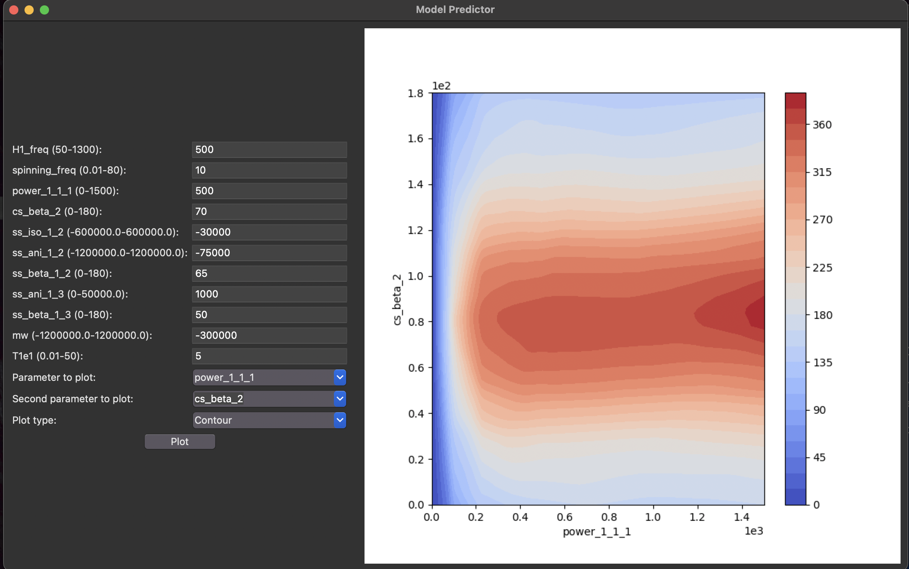

# Machine Learning Model for Quantum Experiments Simulation Prediction

## Introduction

This repository contains the code and documentation for a machine learning project aimed at simulating quantum experiments. The project utilizes deep learning techniques to streamline traditional methods, which are often computationally intensive and time-consuming. The model offers increased efficiency and accuracy, providing insightful visualizations and enabling simultaneous comparison of parameters.

## Methods

### Data Collection
Data was generated from the SpinEvolution platform, using NYU's Jubail supercomputer. The dataset comprises 500,000 experiments with various parameters affecting the spin outcome.

### Model Architecture
The model employs a sequential architecture with multiple layers, including batch normalization and dropout mechanisms. It's designed to predict the spin outcome based on the given parameters.

You can see the model training code in *main.py*

### Training and Hyperparameter Tuning
The model was trained using 5-fold cross-validation with the Adam optimizer. Early stopping was employed to prevent overfitting.

## Interactive User Interface
An interactive UI has been developed for predicting spin values, integrating various Python libraries for machine learning, numerical operations, and graphical display.
review the code on *mainUI.py*

## Results
The model showed a significant improvement in predicting the outcomes of quantum experiments, with an R^2 value reaching up to 0.97.

## Discussion
The deep learning model offers a more efficient and scalable solution compared to traditional models. Adjustments in hyperparameters and the use of K-fold cross-validation were key in enhancing model accuracy.

## Conclusion
This project highlights the potential of machine learning in revolutionizing quantum experiment simulations. Future work may focus on refining the model, exploring other architectures, and potentially integrating quantum computing.
